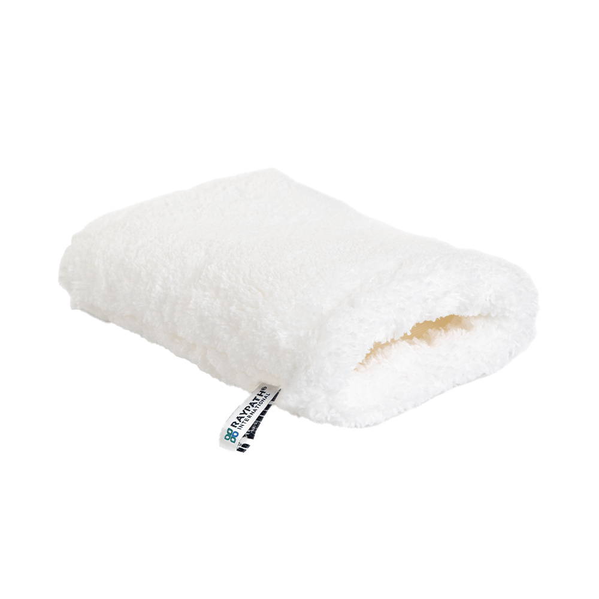

<!doctype html>
<html lang="pl">
<head>
  <meta charset="utf-8" />
  <meta name="viewport" content="width=device-width, initial-scale=1" />
  <title>Raypath — Oddział Wrocław | Pokazy i produkty bez chemii</title>
  <meta name="robots" content="index,follow" />
  <link rel="canonical" href="https://wroclaw.raypath.info/" />
  <meta property="og:url" content="https://wroclaw.raypath.info/" />
  <meta property="og:image" content="tlo.jpg" />
  <meta property="og:locale" content="pl_PL" />
  <meta name="twitter:card" content="summary_large_image" />
  
  
  
  
</head>
<body>
  <!-- HEADER -->
  <header>
    

      

        
        

          
RAYPATH INTERNATIONAL

          
Przedstawiciel regionalny — Wrocław

        

      

      
      <button class="mobile-toggle" id="navToggle" aria-expanded="false" aria-controls="primaryNav">
        Otwórz menu☰
      </button>
      <nav id="primaryNav" class="nav">
        <a href="#produkty">Produkty</a>
        <a href="#materialy">Materiały</a>
        <a href="#ecobody">ECOBody</a>
        <a href="#branze">Branże</a>
        <a href="#wspolpraca">Współpraca</a>
        <a href="#pokazy">Rezerwacje</a>
        <a href="#o-nas">O nas</a>
        <a href="#opinie">Opinie</a>
        <a href="#galeria">Galeria</a>
        <a href="#faq">FAQ</a>
        <a href="#kontakt" class="btn" style="padding:10px 14px">Kontakt</a>
      </nav>
    

  </header>

  <!-- HERO -->
  <section class="hero">
    

      

        <h1>Czysty dom i auto bez chemii</h1>
        

          Oryginalne produkty Raypath® z mikrowłóknem i technologią NanoSilver. Pokazy na żywo w domu, na targach i eventach.
        

        

          <a class="btn" href="#produkty">Zobacz produkty</a>
          <a class="btn alt" href="#pokazy">Zamów pokaz</a>
        

        
Znaki towarowe użyte za pisemną zgodą. Dodaj własne logo/dopisek „Oddział {miasto}”.

      

      

        <!-- HERO IMAGE: zapisz swoje zdjęcie jako tlo.jpg obok pliku index.html -->
        
      

    

  </section>

  <!-- USP -->
  <section style="background:#fff; border-top:1px solid var(--ring); border-bottom:1px solid var(--ring)">
    

      

        
Tylko woda

        
Czyściki działają z użyciem samej wody — bez detergentów.

      

      

        
NanoSilver

        
Dodatek nanosrebra we włóknach ogranicza namnażanie bakterii w materiale.*

      

      

        
Ekonomia

        
Mniej środków czystości i dłuższa żywotność produktów.

      

      

        
Recykling

        
Zużyte czyściki możesz odesłać — otrzymasz nowe z rabatem.

      

    

  </section>

  <!-- KATEGORIE -->
  <section id="produkty">
    

      <h2 style="font-size:28px; margin:0 0 6px 0">Produkty Raypath — kategorie</h2>
      
Czyściki z mikrowłóknem i NanoSilver, kosmetyki, suplementy oraz ECOBody Care.

      

        <article class="card kafel shadow">
          
          <h3>Czyściki i rękawice</h3>
          
Biały, Beżowy, Różowy, Sunbeam – dobierz zestaw do powierzchni.

          <a class="btn" href="https://wroclaw.raypath.info" style="margin-top:8px">Kup teraz</a>
        </article>
        <article class="card kafel shadow">
          
          <h3>Mopy i podłogi</h3>
          
Szybkie mycie, polerowanie i pielęgnacja podłóg.

          <a class="btn" href="https://wroclaw.raypath.info" style="margin-top:8px">Kup teraz</a>
        </article>
        <article class="card kafel shadow">
          
          <h3>The Ritual</h3>
          
Kosmetyki pielęgnacyjne na co dzień.

          <a class="btn" href="https://wroclaw.raypath.info" style="margin-top:8px">Kup teraz</a>
        </article>
        <article class="card kafel shadow">
          
          <h3>Naturalne suplementy</h3>
          
Wsparcie codziennej rutyny.

          <a class="btn" href="https://wroclaw.raypath.info" style="margin-top:8px">Kup teraz</a>
        </article>
        <article class="card kafel shadow">
          
          <h3>ECOBody Care</h3>
          
Rękawice Face/Body, naturalne mydła i pielęgnacja.

          <a class="btn" href="https://wroclaw.raypath.info" style="margin-top:8px">Kup teraz</a>
        </article>
      

    

  </section>

  <!-- MATERIAŁY RAYPATH -->
  <section id="materialy" style="background:#fff; border-top:1px solid var(--ring); border-bottom:1px solid var(--ring)">
    

      <h2 style="font-size:28px; margin:0 0 6px 0">Materiały Raypath</h2>
      
Dobierz materiał do zadania: na mokro, wilgotno lub na sucho.

      

        <article class="card kafel shadow">
          
          <h3>Biały materiał</h3>
          
Najwyższa siła czyszcząca. Do powierzchni dobrze znoszących wodę: okna, armatura, szkło, drzwi, twarde podłogi.

          <a class="btn" href="https://wroclaw.raypath.info">Kup teraz</a>
        </article>
        <article class="card kafel shadow">
          
          <h3>Beżowy / Biały Nova</h3>
          
Do powierzchni, które nie lubią nadmiaru wody: drewno, meble, parkiety, elektronika, biżuteria, rośliny.

          <a class="btn" href="https://wroclaw.raypath.info">Kup teraz</a>
        </article>
        <article class="card kafel shadow">
          
          <h3>Różowy materiał</h3>
          
Usuwanie kurzu na sucho. Ładunek antystatyczny spowalnia ponowne osadzanie pyłu. Idealny do polerowania.

          <a class="btn" href="https://wroclaw.raypath.info">Kup teraz</a>
        </article>
        <article class="card kafel shadow">
          
          <h3>Sunbeam</h3>
          
Bardzo chłonny. Do zbierania resztek wody, emulsji i finalnego polerowania: okna, lustra, lampy, ceramika, optyka, naczynia.

          <a class="btn" href="https://wroclaw.raypath.info">Kup teraz</a>
        </article>
      

      
Opisy zostały zredagowane pod SEO i nie stanowią deklaracji właściwości leczniczych.

    

  </section>

  <!-- ECOBODY CARE -->
  <section id="ecobody">
    

      <h2 style="font-size:28px; margin:0 0 6px 0">ECOBody Care</h2>
      
Domowe SPA: rękawice do twarzy i ciała oraz naturalne mydła.

      

        <article class="card kafel shadow">
          
          <h3>Face Glove</h3>
          
Delikatne oczyszczanie i demakijaż tylko z wodą — miękki materiał przyjazny dla skóry.

          <a class="btn" href="https://wroclaw.raypath.info">Kup teraz</a>
        </article>
        <article class="card kafel shadow">
          
          <h3>Body Glove</h3>
          
Codzienna pielęgnacja pod prysznicem — pobudza mikrokrążenie i odświeża skórę.

          <a class="btn" href="https://wroclaw.raypath.info">Kup teraz</a>
        </article>
        <article class="card kafel shadow">
          
          <h3>Face Cleaner</h3>
          
Bezpieczny peeling twarzy. Wygładza i rozświetla cerę — idealny przed makijażem.

          <a class="btn" href="https://wroclaw.raypath.info">Kup teraz</a>
        </article>
        <article class="card kafel shadow">
          
          <h3>Body Cleaner</h3>
          
Peeling i masaż ciała na sucho lub na mokro. Wspiera gładkość i jędrność skóry.

          <a class="btn" href="https://wroclaw.raypath.info">Kup teraz</a>
        </article>
      

    

  </section>

  <!-- BRANŻE I ZASTOSOWANIA -->
  <section id="branze" style="background:#fff; border-top:1px solid var(--ring); border-bottom:1px solid var(--ring)">
    

      <h2 style="font-size:28px; margin:0 0 6px 0">Branże i zastosowania</h2>
      
Wybierz obszar, a przygotujemy dedykowaną prezentację i zestaw produktów.

      

        <article class="card shadow"><h3>Dom i mieszkanie</h3>
Okna, łazienka, kuchnia, podłogi, lustra, AGD.
</article>
        <article class="card shadow"><h3>Auto & detailing</h3>
Karoseria, wnętrze, szyby, ekoskóra, multimedia.
</article>
        <article class="card shadow"><h3>Biuro i usługi</h3>
Biurka, sprzęt elektroniczny, sale konferencyjne.
</article>
        <article class="card shadow"><h3>Beauty & SPA</h3>
Rękawice do twarzy i ciała, naturalne mydła.
</article>
        <article class="card shadow"><h3>Gastro</h3>
Stal, szkło, ceramika, blaty robocze, polerowanie.
</article>
        <article class="card shadow"><h3>Hotel</h3>
Szybkie utrzymanie czystości pokoi i stref wspólnych.
</article>
      

    

  </section>

  <!-- WSPÓŁPRACA -->
  <section id="wspolpraca">
    

      <h2 style="font-size:28px; margin:0 0 6px 0">Współpraca — dołącz do zespołu</h2>
      
Szukasz elastycznego zajęcia w sprzedaży bezpośredniej? Pokażemy Ci, jak prowadzić pokazy i budować własną sieć klientów.

      

        <article class="card shadow"><h3>Szkolenia i materiały</h3>
Gotowe scenariusze pokazów, grafiki, filmy i wsparcie mentora.
</article>
        <article class="card shadow"><h3>Elastyczny czas pracy</h3>
Pokazy domowe, eventy firmowe, targi, social media.
</article>
        <article class="card shadow"><h3>Prosty start</h3>
Zestaw startowy i ścieżka wdrożenia — krok po kroku.
</article>
      

      

        <a class="btn" href="mailto:raypathwroclaw@gmail.com?subject=Dołączam%20do%20zespołu%20Raypath%20Wrocław&body=Imię%20i%20nazwisko:%0ATelefon:%0ADlaczego%20chcę%20współpracować:%0A">Zgłoś chęć współpracy</a>
        <a class="btn alt" href="#pokazy">Zobacz jak wygląda pokaz</a>
      

    

  </section>

  <!-- WYDARZENIA / POKAZY -->
  <section id="pokazy" style="background:#fff; border-top:1px solid var(--ring); border-bottom:1px solid var(--ring)">
    

      <h2 style="font-size:28px; margin:0 0 6px 0">Zarezerwuj pokaz</h2>
      
Wybierz termin, produkt i zostaw kontakt. Potwierdzimy rezerwację telefonicznie.

      

        <!-- KALENDARZ -->
        

          

            <button class="mobile-toggle" id="prevMonth">◀</button>
            
<strong id="calTitle">Kalendarz</strong>

            <button class="mobile-toggle" id="nextMonth">▶</button>
          

          

          
Dni zaznaczone na zielono mają wolne terminy.

        

        <!-- FORMULARZ REZERWACJI -->
        

          <form id="bookingForm" class="form-grid">
            

              <label class="muted" for="productSelect">Wybierz produkt/pokaz</label>
              <select id="productSelect" class="card" required>
                <option value="Czyściki i rękawice">Czyściki i rękawice</option>
                <option value="Mopy i podłogi">Mopy i podłogi</option>
                <option value="ECOBody Care">ECOBody Care</option>
                <option value="The Ritual — kosmetyki">The Ritual — kosmetyki</option>
                <option value="Suplementy">Naturalne suplementy</option>
                <option value="Detailing auta">Detailing auta</option>
              </select>
            

            

              <label class="muted" for="custName">Imię i nazwisko</label>
              <input id="custName" class="card" placeholder="Jan Kowalski" required>
            

            

              <label class="muted" for="custPhone">Telefon</label>
              <input id="custPhone" class="card" placeholder="794 566 404" pattern="[0-9 +()-]{7,}" required>
            

            

              <label class="muted" for="custEmail">E-mail (opcjonalnie)</label>
              <input id="custEmail" type="email" class="card" placeholder="jan@przyklad.pl">
            

            

              
Wybierz godzinę

              

            

            

              <label class="muted" for="notes">Dodatkowe informacje</label>
              <textarea id="notes" class="card" rows="3" placeholder="Adres pokazu / preferencje"></textarea>
            

            <label class="md:col-span-2" style="display:flex; gap:8px; align-items:flex-start">
              <input type="checkbox" required style="margin-top:6px">
              Wyrażam zgodę na kontakt w sprawie rezerwacji pokazu.
            </label>
            

              <button class="btn" type="submit">Zarezerwuj</button>
              <a class="btn alt" href="https://wroclaw.raypath.info" target="_blank" rel="noopener">Kup teraz</a>
            

            

          </form>
        

      

    

  </section>

  <!-- O NAS -->
  <section id="o-nas">
    

      
      

        <h2 style="font-size:28px; margin:0 0 6px 0">Raypath — Wrocław</h2>
        
Lokalny zespół konsultantów. Prowadzimy pokazy i dobieramy zestawy pod Twoje potrzeby: dom, samochód, biuro.

        <ul style="margin-top:10px">
          <li>Legalne użycie znaków towarowych Raypath® (pisemna zgoda).</li>
          <li>Sprzedaż online i offline: pokazy, targi, social media.</li>
          <li>Wsparcie posprzedażowe i instruktaże wideo.</li>
        </ul>
      

    

  </section>

  <!-- OPINIE -->
  <section id="opinie" style="background:#fff; border-top:1px solid var(--ring); border-bottom:1px solid var(--ring)">
    

      <h2 style="font-size:28px; margin:0 0 6px 0">Opinie klientów</h2>
      

        <figure class="card shadow"><blockquote>“Świetna demonstracja, sprzątanie szybciej i bez zapachu chemii.”</blockquote>

<figcaption class="muted" style="font-size:14px">Anna, Wrocław</figcaption></figure>
        <figure class="card shadow"><blockquote>“Mopy do podłóg — petarda. Okna zrobiłam w 15 minut.”</blockquote>

<figcaption class="muted" style="font-size:14px">Kasia</figcaption></figure>
        <figure class="card shadow"><blockquote>“Do auta najlepszy zestaw, kokpit i szyby lśnią.”</blockquote>

<figcaption class="muted" style="font-size:14px">Michał</figcaption></figure>
      

    

  </section>

  <!-- GALERIA -->
  <section id="galeria" style="background:#fff; border-top:1px solid var(--ring); border-bottom:1px solid var(--ring)">
    

      <h2 style="font-size:28px; margin:0 0 6px 0">Galeria pokazów</h2>
      
Zdjęcia z prezentacji domowych i eventów. Kliknij, aby powiększyć.

      

        
        
        
        
        
        
      

    

  </section>

  <!-- FAQ -->
  <section id="faq">
    

      <h2 style="font-size:28px; margin:0 0 6px 0">Najczęstsze pytania</h2>
      

        

          
Czy naprawdę nie używacie chemii?

          
Tak. Standardowe mycie odbywa się wyłącznie przy użyciu wody i odpowiednio dobranych czyścików z mikrowłókna.

        

        

          
Czym jest technologia NanoSilver?

          
To dodatek nanosrebra we włóknach, który ogranicza namnażanie bakterii w materiale.* Produkt nie jest środkiem dezynfekującym.

        

        

          
Jak zamówić pokaz?

          
Wypełnij formularz poniżej lub zadzwoń — oddzwonimy i ustalimy dogodny termin.

        

      

    

  </section>

  <!-- CTA -->
  <section style="background:#0a0a0a; color:#fff">
    

      

        <h3 style="margin:0">Chcesz zobaczyć produkty na żywo?</h3>
        
Zorganizujemy pokaz w domu lub spotkajmy się na evencie.

      

      <a class="btn" href="#pokazy" style="background:#fff; color:#0a0a0a">Umów termin</a>
    

  </section>

  <!-- KONTAKT -->
  <section id="kontakt">
    

      <h2 style="font-size:28px; margin:0 0 6px 0">Kontakt</h2>
      
Oddział Wrocław • <a href="https://maps.google.com/?q=Kie%C5%82czowska+138A,+Wroc%C5%82aw" target="_blank" rel="noopener">ul. Kiełczowska 138A, Wrocław</a> • tel. <a href="tel:+48794566404">794 566 404</a> • <a href="mailto:raypathwroclaw@gmail.com">raypathwroclaw@gmail.com</a>

      <form class="grid grid-2" style="margin-top:16px; gap:12px" onsubmit="event.preventDefault(); alert('Dziękujemy! Skontaktujemy się wkrótce.');">
        <input class="card" placeholder="Imię i nazwisko" required>
        <input class="card" type="email" placeholder="E-mail" required>
        <input class="card" placeholder="Telefon" pattern="[0-9 +()-]{7,}">
        <textarea class="card" rows="4" placeholder="Wiadomość / preferowany termin"></textarea>
        <label class="card" style="display:flex; align-items:flex-start; gap:8px">
          <input type="checkbox" required style="margin-top:6px">
          Wyrażam zgodę na kontakt w celu przedstawienia oferty i umówienia pokazu. Administratorem danych jest Oddział Wrocław.
        </label>
        <button class="btn" type="submit">Wyślij</button>
      </form>
      
* Informacyjnie: treści marketingowe nie stanowią obietnicy efektu; kosmetyki i suplementy nie leczą chorób.

    

  </section>

  <footer>
    

      
©  Raypath — Oddział Wrocław. Wszelkie prawa zastrzeżone.

      
Znaki towarowe Raypath® użyte za pisemną zgodą. Strona informacyjno‑sprzedażowa.

    

  </footer>

  
  // === LIGHTBOX ===
    const lb = document.createElement('div');
    lb.className='lb-backdrop';
    lb.innerHTML = '<button class="lb-close" aria-label="Zamknij">Zamknij ✕</button>';
    document.body.appendChild(lb);
    const lbImg = lb.querySelector('.lb-img');
    const lbClose = lb.querySelector('.lb-close');
    function openLb(src, alt){ lbImg.src = src; lbImg.alt = alt||''; lb.classList.add('show'); }
    function closeLb(){ lb.classList.remove('show'); lbImg.src=''; }
    lb.addEventListener('click', (e)=>{ if(e.target===lb){ closeLb(); }});
    lbClose.addEventListener('click', closeLb);
    document.addEventListener('keydown', (e)=>{ if(e.key==='Escape') closeLb(); });
    document.querySelectorAll('[data-lightbox]').forEach(el=>{
      el.style.cursor='zoom-in';
      el.addEventListener('click', ()=> openLb(el.src, el.alt));
    });
  </script>
</body>
</html>
